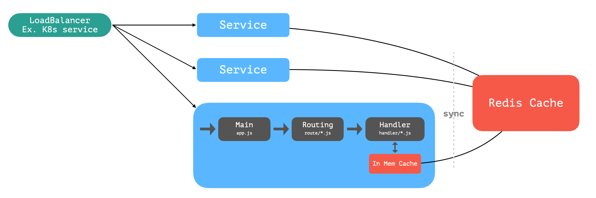

# Roman Numeral Convertor
A application that converts numbers to roman numerals. See [Romannumeral Specification](#Reference).

# Table of Content
- [Roman Numeral Convertor](#roman-numeral-convertor)
- [Table of Content](#table-of-content)
- [Service](#service)
  - [Service Basics](#service-basics)
  - [Service Diagram](#service-diagram)
  - [Folder Structure](#folder-structure)
  - [Log Style](#log-style)
- [Development Setup](#development-setup)
  - [local](#local)
  - [local-redis](#local-redis)
  - [Code Style and Linter](#code-style-and-linter)
- [Build](#build)
  - [Dockerfile](#dockerfile)
- [Pipeline Automation](#pipeline-automation)
- [Dependency and Reference](#dependency-and-reference)
  - [Dependency](#dependency)
    - [Major](#major)
    - [Utility](#utility)
    - [Test](#test)
  - [Dev](#dev)
    - [Reference](#reference)
- [Testing](#testing)
  - [Unit Test](#unit-test)
  - [API Test](#api-test)
  - [Load Test](#load-test)
- [Deployment](#deployment)
  - [docker-compose](#docker-compose)
  - [kubernetes](#kubernetes)
  - [custom](#custom)
- [Metrics, Alerts, and Monitoring](#metrics-alerts-and-monitoring)
  - [Application Metric](#application-metric)

# Service
## Service Basics
Main convertion logic is located in `src/service/intToRomanNumeral.js`.

## Service Diagram
A time-based sync mechanism across multiple replicas for better performance can be turned on through [configuration](#custom) by setting `enableRedisCache` to `true`. If not application by default keeps a map of in memory cache.


 
## Folder Structure
```
index.js        # For ESM module only
src
│   app.js      # Entry point
└───handler         # Route handler
└───route       # Application routes
└───service     # Business logic
└───config      # Configuration
└───model       # Models and Classes
└───util        # Utilities
test
└───api         # api test folder
└───unit        # unit test folder
```
## Log Style
Follow [NCSA Common Log Format](https://en.wikipedia.org/wiki/Common_Log_Format) for HTTP access logs. Non HTTP access logs are in format of `YYYY-MM-DD HH:mm:ss.SSS [LEVEL] message`, and if necessary can be easily changed to centralized logging server required format.

Application log level can be set through configuration, see [Deployment>custom](#custom).

# Development Setup
There are 2 of environments in `src/config/index.js` which can be used develop locally.
One must install all dependencies before dev through `yarn install`. 
NodeJS version 14+ is suggested for local development.

___!!! Do not use `npm` as `yarn.lock` is being used for install at build time, `npm` only generates `package-lock.json`___
## local
Develop locally without external cache service.
```bash
$ yarn
$ yarn dev
```

## local-redis
Develop locally with redis as external cache service.

 This requires a running redis instance, one can use redis docker image for quick development usage.
```bash
$ yarn
# one can run redis in the background with "&" at the end, or simply run it in another terminal session.
$ docker run -it -p 6379:6379 redis:alpine3.13 &
$ yarn dev:redis
```

## Code Style and Linter
Using eslint for code linting. Refer to .eslintrc.js for codestyle.
One can setup auto formating base on the eslintrc.js or run `yarn lint` and `yarn lint:fix`. 

# Build
The build section covers how to build the docker image of the application.

## Dockerfile
To build the docker image run `docker build . -t <image> `.

The docker image contains 2 intermediate images and a final image, where
- builder - for building production image
- tester - for testing application (which installs dev dependencies)
- final - use distroless image for security

TODO:
- use bazel to make image use nonroot 65532 by default, currently this need to be specified when starting container with the container runtime.

# Pipeline Automation
This project currently only implement CI using CircleCI without any CD automation.
Every commit push to the repository will have a corresponding pipeline build.
The CI pipeline will build the docker image and run unit test during build.
Built images will be tagged with branch name and push to dockerhub.

# Dependency and Reference
## Dependency
All these dependencies are from `npm`. See `package.json` for full list of dependencies with version details.
### Major
- HTTP Routing Framework: `koa` stack + `boom` + `negotiator`
- ES6 Module: `esm`
- Cache: `redis`

### Utility
- Metrics: `prom-client`
- Validation: `validator`
- Logging: `simple-node-logger` + `koa-accesslog`

### Test
- HTTP Client: `axios`
- Test Framework: `jest` stack

## Dev
- Linter: `eslint` stack
- Others: `nodemon`, ` cross-env`

### Reference
- .gitignore https://github.com/github/gitignore/blob/master/Node.gitignore
- .dockerignore https://github.com/RisingStack/kubernetes-nodejs-example/blob/master/.dockerignore
- Roman numeral specification https://en.wikipedia.org/wiki/Roman_numerals


# Testing
Both Unit and API tests follow table driven testing style using Jest Tagged Template Literal table.
## Unit Test
Unit testing is ran automatically when building docker image. To run it locally,
```bash
$ yarn test:unit
```

Current test cases contain basic functionality, valdiation, as well as many edge cases.

## API Test
API testing are currently not automated, to run it server must up and running.
```bash
$ yarn test:api
```

Test can also be done during deployment, see [Deployment>kubernetes](#kubernetes) on how to deploy. API test currently only covers basic functionality and does not test metric endpoint.

## Load Test
>💡 Below load testing results can only be used for reference.
The test setup is through running on a one node k8s instance (kind k8s@1.20.2) using `vegeta` with resource:
```yaml
resources:
  requests:
    memory: "100Mi"
  limits:
    cpu: "200m"
    memory: "200Mi"
```
Below are the average outputs of 150rps and 200rps. The result shows that application is able to take around 150rps at most for better performance.

```bash 
❯ echo "GET http://localhost:8080/romannumeral?query=3999" | vegeta attack -duration=10s -rate=200 |  vegeta report
Requests      [total, rate, throughput]         2000, 200.09, 199.00
Duration      [total, attack, wait]             10.05s, 9.995s, 55.1ms
Latencies     [min, mean, 50, 90, 95, 99, max]  10.688ms, 515.128ms, 482.887ms, 822.74ms, 1.213s, 1.459s, 1.93s
Bytes In      [total, mean]                     92000, 46.00
Bytes Out     [total, mean]                     0, 0.00
Success       [ratio]                           100.00%
Status Codes  [code:count]                      200:2000  
Error Set:
❯ echo "GET http://localhost:8080/romannumeral?query=3999" | vegeta attack -duration=10s -rate=150 |  vegeta report
Requests      [total, rate, throughput]         1500, 150.09, 146.41
Duration      [total, attack, wait]             10.245s, 9.994s, 251.367ms
Latencies     [min, mean, 50, 90, 95, 99, max]  2.646ms, 6.861ms, 4.354ms, 8.109ms, 14.261ms, 46.544ms, 258.782ms
Bytes In      [total, mean]                     69000, 46.00
Bytes Out     [total, mean]                     0, 0.00
Success       [ratio]                           100.00%
Status Codes  [code:count]                      200:1500  
Error Set:
```

TODO:
- Jest source map for esm
- more detailed API test
- test cache mechanism


# Deployment
There are 2 of environments in `src/config/index.js` which suites better for deployment.
> 💡 currently changes to deployment spec must be made for both docker-compose and kubernetes
## docker-compose
To deploy through docker compose, one should refer to `docker-compose.yaml` for setup configuration.

Note that redis volume is mounted at /tmp/data.
```bash
$ docker-compose up
```
## kubernetes
To deploy on kubernetes, one should refer to `kubernetes` folder for all resource configuration.

Note that redis is being deployed as a statless application, which do not persist data over restart.
```bash
$ kubectl apply -n <namespace> -f kubernetes/redis-cache.yaml -f kubernetes/roman-numeral-convertor.yaml
```

API test can also be done throught kubernetes
```bash
$ kubectl apply -n <namespace> -f kubernetes/runtime.yaml
```

## custom
One can add a configuration to `src/config/index.js` for any custom setup. Below are the fields that can be configured.
```javascript
{
  name: 'roman-numeral-convertor',
  redisURL: 'redis://127.0.0.1:6379',
  enableRedisCache: false,
  cacheSyncInterval: 5000, // ms
  logLevel: 'debug' // trace, debug, info, warn, error 
}
```
# Metrics, Alerts, and Monitoring
Nodejs application default metrics are collected and exposes through `/metrics` endpoint path. The format is simple text-based exposition format that prometheus accepts. Alerts definitions are located in `/kubernetes/prometheus/alerts.yaml`.

Sample grafana dashboard that is compatible with exposed metrics can be found [here](https://github.com/RisingStack/example-prometheus-nodejs/blob/master/grafana-dashboard.json).

>💡 If application is exposed to external in production, one should expose another port for metric endpoint and place necessary network control for it.

## Application Metric
These application metrics are located in `src/model/metric.js`. 
- http_request_duration_ms: Duration of HTTP requests in microseconds
- cache_sync: Number of times cache sync occurs
- cache_error: Number of times cache errors

Alert and monitoring resource spec for kubernetes `kubernetes/prometheus` folder, though namespace and fields must be filled out.

TODO:
- custom grafana dashboard
- if custom metrics can be retrieved, add HPA base on metrics
